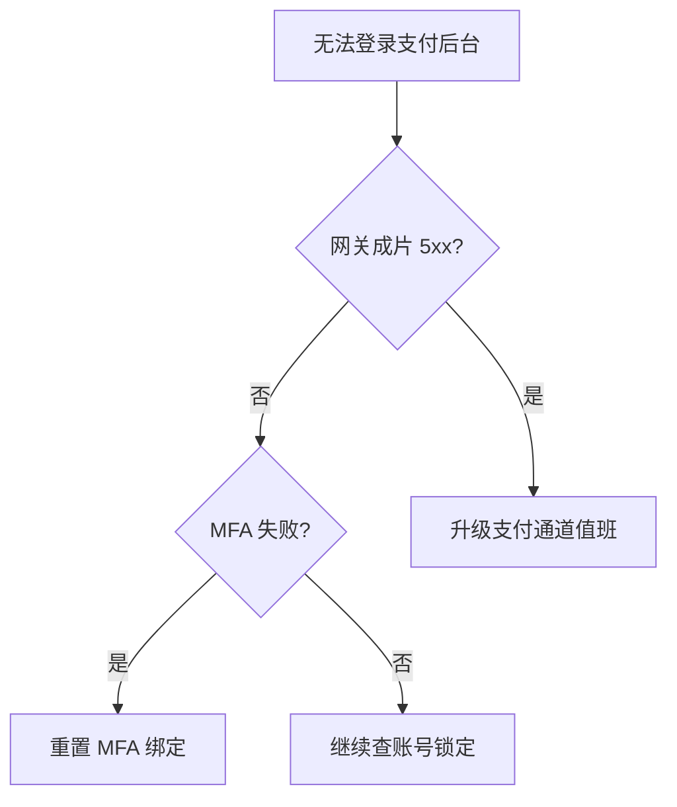
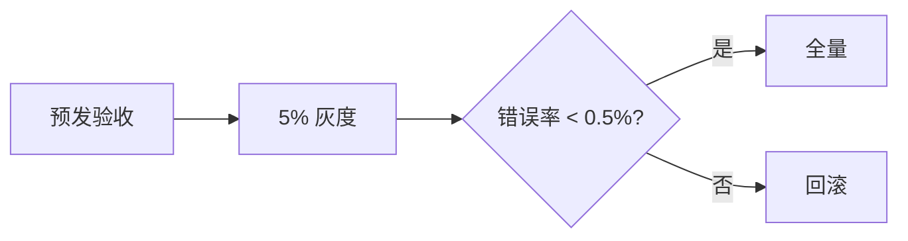
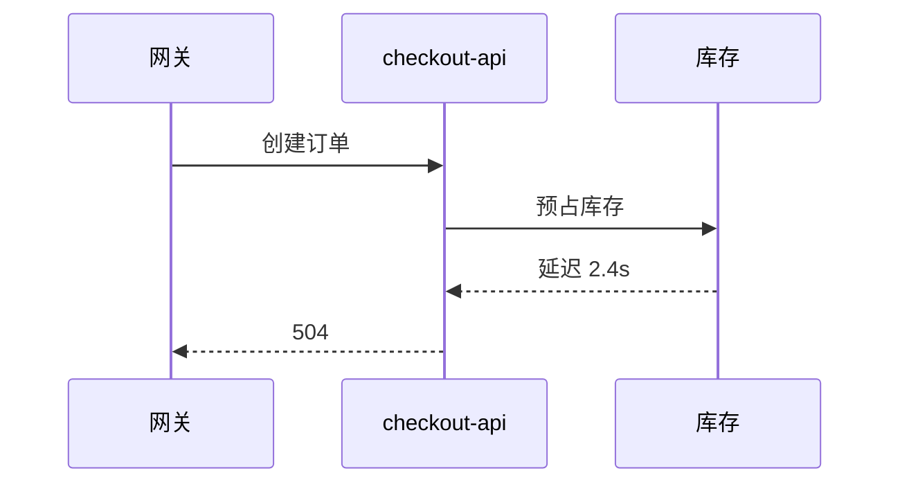

# Docs 业务场景演示 Implementation Plan

> **For agentic workers:** REQUIRED SUB-SKILL: Use superpowers:subagent-driven-development (recommended) or superpowers:executing-plans to implement this plan task-by-task. Steps use checkbox (`- [ ]`) syntax for tracking.

**Goal:** 在 `packages/docs` 新增只读可交互路由 `/scenes`：7 个业务场景、三种薄壳、助手追问、附件预览、本地报障表；不改 `/demo` 工作台与 `packages/simple`。

**Architecture:** 纯函数（场景 id、预制回复、表单校验、预览模型）与 Vue 阅读器分离。`Scenes.vue` 只解析 `?tab=`；`SceneReader` 按壳组合 `MarkdownRenderer`、对话、表单；HTTP 卡片通过 provide 打开预览，不请求 example.com 真实文件。

**Tech Stack:** Vue 3 SFC + TSX、Vue Router、`@nnnb/markdown-ui` 的 `MarkdownRenderer`、Element Plus（`ElDialog` / `ElDrawer` / `ElMessage` / 表单控件）、docs 现有 `esno` CLI 测纯函数。

## Global Constraints

- 只改 `packages/docs`。禁止改 `packages/simple/**`、`packages/docs/src/demo/**`、`packages/components/**`、`packages/markdown-ui` 工作台。
- `/scenes` 禁止使用 `MarkdownWorkbench`：无编辑器、无特性开关 UI、无工作台「流式输入」、无源码面板。
- 不实现通用 `:::form` 引擎；报障表是场景内 Vue 表单。
- 不接 LLM / 工单 / 对象存储；追问与提交仅本地状态，不写 `localStorage`。
- 侧栏与 Home 业务卡不出现 `remark*` / `rehype*` / 插件名。
- 注释使用 JSDoc。色板对齐 `.cursor/rules/docs-ui.mdc`（slate + `#2563eb`）。
- 规格原文：`docs/superpowers/specs/2026-09-18-docs-business-scenes-design.md`。

---

## File Structure

**Create**

- `packages/docs/src/scenes/types.ts` — `SceneId`、壳、对话、表单、预览模型
- `packages/docs/src/scenes/constants.ts` — `SCENE_IDS`、`DEFAULT_SCENE_ID`、`TICKET_ID`、`MAX_FOLLOW_UPS`、`FOLLOW_UP_DELAY_MS`
- `packages/docs/src/scenes/resolveSceneId.ts` — URL tab 解析
- `packages/docs/src/scenes/sceneFeatures.ts` — 每场景写死的 `MarkdownFeatures`
- `packages/docs/src/scenes/sceneData.ts` — 元数据 + 7 篇 Markdown
- `packages/docs/src/scenes/cannedReplies.ts` — 关键字匹配预制回复
- `packages/docs/src/scenes/intakeValidation.ts` — 报障表校验
- `packages/docs/src/scenes/attachmentPreviewModel.ts` — 点击资源 → 预览模型
- `packages/docs/src/scenes/HttpResourceMark.tsx` — a/img 分类卡片
- `packages/docs/src/scenes/httpResourceMark.scss`
- `packages/docs/src/scenes/AttachmentPreview.vue`
- `packages/docs/src/scenes/IntakeForm.vue`
- `packages/docs/src/scenes/SceneNav.vue`
- `packages/docs/src/scenes/SceneShells.vue`
- `packages/docs/src/scenes/SceneReader.vue`
- `packages/docs/src/scenes/cli.ts` — 纯函数回归
- `packages/docs/src/pages/Scenes.vue`

**Modify**

- `packages/docs/package.json` — `"test:scenes": "esno src/scenes/cli.ts"`
- `packages/docs/src/router/index.ts` — `/scenes`
- `packages/docs/src/App.vue` — 顶栏 + `isWidePage`
- `packages/docs/src/pages/Home.vue` — Hero / 业务卡片 / prefetch

**Do not create:** `packages/docs/src/test/scenes/` 可视化 AST 页。

---

### Task 1: 场景常量、类型与 resolveSceneId

**Files:**
- Create: `packages/docs/src/scenes/constants.ts`
- Create: `packages/docs/src/scenes/types.ts`
- Create: `packages/docs/src/scenes/resolveSceneId.ts`
- Create: `packages/docs/src/scenes/cli.ts`
- Modify: `packages/docs/package.json`

**Interfaces:**
- Consumes: 无
- Produces:
  - `SCENE_IDS: readonly SceneId[]`
  - `DEFAULT_SCENE_ID: 'assistant'`
  - `TICKET_ID: 'INC-20260918-0142'`
  - `MAX_FOLLOW_UPS: 3`
  - `FOLLOW_UP_DELAY_MS: 400`
  - `resolveSceneId(raw: unknown): SceneId`
  - `canSendFollowUp(sentCount: number): boolean`

- [ ] **Step 1: 写失败 CLI**

创建 `packages/docs/src/scenes/cli.ts`：

```ts
import { canSendFollowUp } from './resolveSceneId';
import { DEFAULT_SCENE_ID, MAX_FOLLOW_UPS } from './constants';
import { resolveSceneId } from './resolveSceneId';

/**
 * @param name 用例名
 * @param ok 是否通过
 */
function check(name: string, ok: boolean): boolean {
  if (!ok) console.error(`[scenes] FAIL ${name}`);
  else console.log(`[scenes] ok ${name}`);
  return ok;
}

let passed = true;
passed = check('default assistant', resolveSceneId(undefined) === DEFAULT_SCENE_ID) && passed;
passed = check('valid sop', resolveSceneId('sop') === 'sop') && passed;
passed = check('invalid fallback', resolveSceneId('gfm') === DEFAULT_SCENE_ID) && passed;
passed = check('third follow-up allowed', canSendFollowUp(2) === true) && passed;
passed = check('fourth blocked', canSendFollowUp(MAX_FOLLOW_UPS) === false) && passed;

process.exit(passed ? 0 : 1);
```

`package.json` 的 `scripts` 增加：

```json
"test:scenes": "esno src/scenes/cli.ts"
```

- [ ] **Step 2: 跑 CLI，确认失败**

Run: `pnpm --filter @nnnb/docs test:scenes`

Expected: FAIL，模块不存在。

- [ ] **Step 3: 最小实现**

`packages/docs/src/scenes/constants.ts`：

```ts
export const SCENE_IDS = [
  'assistant',
  'sop',
  'postmortem',
  'reasoning',
  'attachments',
  'intake',
  'capacity'
] as const;

export type SceneId = (typeof SCENE_IDS)[number];

export const DEFAULT_SCENE_ID: SceneId = 'assistant';

export const TICKET_ID = 'INC-20260918-0142';

export const MAX_FOLLOW_UPS = 3;

export const FOLLOW_UP_DELAY_MS = 400;
```

`packages/docs/src/scenes/types.ts`：

```ts
import type { MarkdownFeatures } from '@nnnb/markdown-ui';
import type { SceneId } from './constants';

export type { SceneId };

export type SceneGroup = 'story' | 'clip';

export type SceneShell = 'assistant' | 'article' | 'ticket';

export interface SceneMeta {
  id: SceneId;
  label: string;
  group: SceneGroup;
  shell: SceneShell;
  description: string;
  features: MarkdownFeatures;
  markdown: string;
}

export interface ChatTurn {
  id: string;
  role: 'user' | 'assistant';
  text: string;
}

export interface IntakeFormValue {
  name: string;
  urgent: boolean;
  reason: string;
  satisfaction: number;
}

export type IntakeValidation =
  | { ok: true }
  | { ok: false; message: string };

export type AttachmentPreviewModel =
  | { mode: 'image'; src: string; alt: string; failed: boolean }
  | { mode: 'file'; href: string; title: string; kind: string; ext: string };
```

`packages/docs/src/scenes/resolveSceneId.ts`：

```ts
import {
  DEFAULT_SCENE_ID,
  MAX_FOLLOW_UPS,
  SCENE_IDS,
  type SceneId
} from './constants';

const SCENE_ID_SET = new Set<string>(SCENE_IDS);

/**
 * 把 URL query.tab 收成合法 SceneId。
 *
 * @param raw `route.query.tab`
 * @returns 非法或缺失时返回 `assistant`
 */
export function resolveSceneId(raw: unknown): SceneId {
  const id = typeof raw === 'string' ? raw : DEFAULT_SCENE_ID;
  return SCENE_ID_SET.has(id) ? (id as SceneId) : DEFAULT_SCENE_ID;
}

/**
 * 已发送追问次数是否仍允许再发。
 *
 * @param sentCount 已经成功发出的用户追问条数（不含初始助手消息）
 */
export function canSendFollowUp(sentCount: number): boolean {
  return sentCount < MAX_FOLLOW_UPS;
}
```

- [ ] **Step 4: 再跑 CLI**

Run: `pnpm --filter @nnnb/docs test:scenes`

Expected: 全部 `ok`，exit 0。

- [ ] **Step 5: Commit**

```bash
git add packages/docs/src/scenes/constants.ts packages/docs/src/scenes/types.ts packages/docs/src/scenes/resolveSceneId.ts packages/docs/src/scenes/cli.ts packages/docs/package.json
git commit -m "$(cat <<'EOF'
feat(docs): add scene id resolver for business demos

EOF
)"
```

---

### Task 2: sceneFeatures 与 sceneData

**Files:**
- Create: `packages/docs/src/scenes/sceneFeatures.ts`
- Create: `packages/docs/src/scenes/sceneData.ts`
- Modify: `packages/docs/src/scenes/cli.ts`

**Interfaces:**
- Consumes: `SceneId`、`SceneMeta`、`MarkdownFeatures`
- Produces:
  - `getSceneFeatures(id: SceneId): MarkdownFeatures`
  - `sceneList: SceneMeta[]`
  - `getScene(id: SceneId): SceneMeta`

所有未列出的 feature 键必须是 `false`。description 必须与 spec 表格逐字一致。

- [ ] **Step 1: 扩展 CLI 断言（先失败）**

在 `cli.ts` 追加：

```ts
import { getScene, sceneList } from './sceneData';
import { getSceneFeatures } from './sceneFeatures';

passed =
  check('seven scenes', sceneList.length === 7) && passed;
passed =
  check(
    'assistant description',
    getScene('assistant').description ===
      '一条完整的运维助手回复：思考、步骤、流程图与附件；可再问一句'
  ) && passed;
passed =
  check('assistant think on', getSceneFeatures('assistant').think === true) &&
  passed;
passed =
  check('reasoning mermaid off', getSceneFeatures('reasoning').mermaid === false) &&
  passed;
passed =
  check('intake no form json', getScene('intake').markdown.includes(':::form') === false) &&
  passed;
passed =
  check('assistant has think tag', getScene('assistant').markdown.includes('<think>') === true) &&
  passed;
```

- [ ] **Step 2: 跑 CLI，确认失败**

Run: `pnpm --filter @nnnb/docs test:scenes`

Expected: FAIL，`sceneData` 不存在。

- [ ] **Step 3: 实现 features + 全文数据**

`sceneFeatures.ts`：

```ts
import type { MarkdownFeatures } from '@nnnb/markdown-ui';
import type { SceneId } from './constants';

const OFF: MarkdownFeatures = {
  gfm: false,
  breaks: false,
  math: false,
  mermaid: false,
  think: false,
  customTags: false,
  codeHighlight: false,
  elTable: false,
  httpResource: false
};

const TABLE: Record<SceneId, MarkdownFeatures> = {
  assistant: { ...OFF, gfm: true, breaks: true, think: true, mermaid: true, httpResource: true },
  sop: { ...OFF, gfm: true, breaks: true, mermaid: true, elTable: true, httpResource: true },
  postmortem: {
    ...OFF,
    gfm: true,
    breaks: true,
    codeHighlight: true,
    mermaid: true,
    elTable: true,
    httpResource: true,
    math: true
  },
  reasoning: { ...OFF, gfm: true, breaks: true, think: true },
  attachments: { ...OFF, gfm: true, breaks: true, httpResource: true },
  intake: { ...OFF, gfm: true, breaks: true },
  capacity: { ...OFF, gfm: true, breaks: true, math: true }
};

/**
 * 返回场景写死的特性副本，避免调用方改到表。
 *
 * @param id 场景 id
 */
export function getSceneFeatures(id: SceneId): MarkdownFeatures {
  return { ...TABLE[id] };
}
```

`sceneData.ts` 必须导出 `sceneList`（顺序：上表 7 个 id）和 `getScene`。每条 `features: getSceneFeatures(id)`。Markdown 全文如下（实现时原样写入对应 id，不要改写成说明书口吻）：

**assistant**

```markdown
星河支付值班助手已接入工单 `INC-20260918-0142`。

<think>
先看网关：过去 15 分钟 checkout-api 没有成片 5xx，支付通道探针是绿的。
更像登录链路，而不是清算中断。
</think>

<think>
登录失败码集中在 MFA_REJECT。用户最近有换机记录。优先当 MFA 设备绑定过期处理。
</think>

现在可以判定：**不是支付通道宕机**，是后台 MFA 未通过。

## 已做的事
- [x] 核对网关 5xx
- [x] 核对 `checkout-api` 探针
- [ ] 请确认是否更换过手机



现场截图（可打开）：


失效截图（会显示加载失败）：


账号说明：[MFA 重置手册](https://example.com/manual.pdf)

下一步：回复「我换手机了」走重置；或把后四位发我，我帮你开重置单。
```

**sop**

```markdown
> 灰度窗口仅限工作日 10:00–11:30。窗口外发布需值班长签字。

## 发布前
1. 冻结非紧急变更
2. 确认回滚镜像 `checkout-api:2026.09.17`
3. 拉齐支付、风控、SRE

## 环境对照

| 环境 | 流量 | 负责人 |
| --- | ---: | --- |
| 预发 | 0% | 陈可 |
| 灰度 | 5% | 周宁 |
| 生产 | 95% | 值班长 |



架构示意：


## 回滚
错误率连续 3 分钟超过 0.5%，或支付成功率掉到 99% 以下，立即回滚并通知 `INC-20260918-0142` 值班群。
```

**postmortem**

```markdown
# 订单超时升高复盘（2026-09-18）

## 时间线
- 09:12 监控：checkout 超时率 0.8% → 6%
- 09:18 定位库存只读副本延迟
- 09:31 切主库，超时率回落



```ts
// checkout-api 09:14 日志
TimeoutError: inventory.reserve exceeded 2000ms
```

## 影响

| 指标 | 峰值 | 恢复后 |
| --- | ---: | ---: |
| 超时率 | 6.1% | 0.4% |
| 支付成功率 | 98.2% | 99.7% |

看板：[监控](https://example.com/grafana/checkout) · [日志](https://example.com/logs/checkout-api)

粗算：副本延迟若到 $t$ 秒，超时概率约随 $t^{2}$ 上升，扩容备忘见容量公式场景。
```

**reasoning**

```markdown
<think>
用户说登不上。先排除通道，再看 MFA。
</think>

<think>
没有 5xx 风暴，MFA_REJECT 对得上换机。
</think>

结论：重置 MFA 即可，不用升级支付通道。
```

**attachments**

```markdown
工单 `INC-20260918-0142` 的现场资料。点击图片或文件卡片可预览（演示环境不会去拉 example.com 的真实字节）。

成功图：


失败图：


说明书：[操作手册](https://example.com/manual.pdf)

对账单：[9 月报表](https://example.com/report.xlsx)

抓包：[dump.zip](https://example.com/file.zip)

https://example.com/voice.mp3

本地备忘（不应出现分类徽标）：[现场记录](./local.png)

联系值班：[邮箱](mailto:oncall@example.com)
```

**intake**

```markdown
请用下面的表提交报障。提交后只留在这台浏览器里，值班同学会在工单 `INC-20260918-0142` 看到你填的内容（本演示不写服务器）。

紧急故障请打开「是否紧急」，并写清影响面。
```

**capacity**

```markdown
# checkout-api 扩容备忘

当前超时阈值为 $T = 2$ 秒。副本延迟均值 $\\mu$，粗估超时比例：

$$
P(t > T) \\approx e^{-T / \\mu}
$$

库存节点数建议保持

$$
\\begin{bmatrix}
n_{read} \\\\
n_{write}
\\end{bmatrix}
=
\\begin{bmatrix}
8 \\\\
2
\\end{bmatrix}
$$

$\mu > 0.8$ 时先扩只读，再谈写库。
```

`getScene`：找不到时仍应 throw（页面层只传 `resolveSceneId` 的结果）。CLI 不测 throw。

- [ ] **Step 4: 再跑 CLI**

Run: `pnpm --filter @nnnb/docs test:scenes`

Expected: 全部 ok。

- [ ] **Step 5: Commit**

```bash
git add packages/docs/src/scenes/sceneFeatures.ts packages/docs/src/scenes/sceneData.ts packages/docs/src/scenes/cli.ts
git commit -m "$(cat <<'EOF'
feat(docs): add business scene copy and feature flags

EOF
)"
```

---

### Task 3: 预制回复

**Files:**
- Create: `packages/docs/src/scenes/cannedReplies.ts`
- Modify: `packages/docs/src/scenes/cli.ts`

**Interfaces:**
- Consumes: `SceneId`
- Produces: `pickCannedReply(sceneId: SceneId, userText: string): string`

匹配规则（对原始字符串做测试，大小写不敏感的拉丁部分用 `/i`）：

1. `/手机|换机|MFA/i` → MFA 回复
2. `/超时|5xx|支付/` → 通道正常回复
3. 其它 → 兜底（必须含「后四位」或「工单号」）

`assistant` 的 MFA 回复须含「重置」；`reasoning` 三条回复都必须含 `<think>`。

- [ ] **Step 1: CLI 断言**

```ts
import { pickCannedReply } from './cannedReplies';

passed =
  check('mfa keyword', pickCannedReply('assistant', '我换手机了').includes('重置')) &&
  passed;
passed =
  check('outage keyword', pickCannedReply('assistant', '订单超时了').includes('checkout-api')) &&
  passed;
passed =
  check(
    'fallback',
    pickCannedReply('assistant', '你好').includes('后四位') ||
      pickCannedReply('assistant', '你好').includes('工单号')
  ) && passed;
passed =
  check('reasoning still think', pickCannedReply('reasoning', '为什么').includes('<think>')) &&
  passed;
```

- [ ] **Step 2: 跑 CLI，确认失败**

Run: `pnpm --filter @nnnb/docs test:scenes`

Expected: FAIL，`cannedReplies` 不存在。

- [ ] **Step 3: 实现**

```ts
import type { SceneId } from './constants';

interface ReplyBank {
  mfa: string;
  outage: string;
  fallback: string;
}

const ASSISTANT: ReplyBank = {
  mfa: `<think>\n换机后旧令牌失效，和 MFA_REJECT 对得上。\n</think>\n\n请在员工中心 → 安全 → 重置 MFA。完成后用新手机关联。不必升级支付通道。`,
  outage: `<think>\n用户提到超时/支付，但当前探针仍绿。\n</think>\n\n\`checkout-api\` 与通道正常。若是下单 504，把时间点和订单号发我；登录问题仍走 MFA。`,
  fallback: `我需要更多线索。请发手机号后四位，或直接报工单号 \`INC-20260918-0142\`。`
};

const REASONING: ReplyBank = {
  mfa: `<think>\n换机 → MFA 失效。\n</think>\n重置 MFA 即可。`,
  outage: `<think>\n不是通道事故。\n</think>\n登录问题不要升支付值班。`,
  fallback: `<think>\n信息不够。\n</think>\n请给后四位或工单号。`
};

/**
 * 按场景和用户输入挑选预制 Markdown 回复。
 *
 * @param sceneId 仅 `assistant` / `reasoning` 有完整词库；其它 id 使用 assistant 词库以免误调用抛错
 * @param userText 用户输入
 */
export function pickCannedReply(sceneId: SceneId, userText: string): string {
  const bank = sceneId === 'reasoning' ? REASONING : ASSISTANT;
  if (/手机|换机|MFA/i.test(userText)) return bank.mfa;
  if (/超时|5xx|支付/.test(userText)) return bank.outage;
  return bank.fallback;
}
```

- [ ] **Step 4: 再跑 CLI**

Run: `pnpm --filter @nnnb/docs test:scenes`

Expected: 全部 ok。

- [ ] **Step 5: Commit**

```bash
git add packages/docs/src/scenes/cannedReplies.ts packages/docs/src/scenes/cli.ts
git commit -m "$(cat <<'EOF'
feat(docs): add canned follow-up replies for scene chat

EOF
)"
```

---

### Task 4: 报障表校验与附件预览模型

**Files:**
- Create: `packages/docs/src/scenes/intakeValidation.ts`
- Create: `packages/docs/src/scenes/attachmentPreviewModel.ts`
- Modify: `packages/docs/src/scenes/cli.ts`

**Interfaces:**
- Consumes: `IntakeFormValue`、`AttachmentPreviewModel`
- Produces:
  - `createEmptyIntakeForm(): IntakeFormValue`（satisfaction 默认 60，urgent 默认 false）
  - `validateIntakeForm(value: IntakeFormValue): IntakeValidation`
  - `buildAttachmentPreview(input: { kind: string; ext: string; href: string; title: string; imageFailed?: boolean }): AttachmentPreviewModel | null`
    - `kind` 为空 → `null`（不拦截）
    - `kind === 'image'` → `{ mode: 'image', src: href, alt: title, failed: Boolean(imageFailed) }`
    - 其它 kind → `{ mode: 'file', href, title, kind, ext }`

- [ ] **Step 1: CLI 断言**

```ts
import { buildAttachmentPreview } from './attachmentPreviewModel';
import { createEmptyIntakeForm, validateIntakeForm } from './intakeValidation';

const empty = createEmptyIntakeForm();
passed = check('default satisfaction', empty.satisfaction === 60) && passed;
passed =
  check('name required', validateIntakeForm(empty).ok === false) && passed;
passed =
  check(
    'urgent reason',
    validateIntakeForm({ ...empty, name: '李', urgent: true, reason: '' }).ok === false
  ) && passed;
passed =
  check(
    'non-urgent ok',
    validateIntakeForm({ ...empty, name: '李', urgent: false }).ok === true
  ) && passed;
passed =
  check('unmarked skip', buildAttachmentPreview({ kind: '', ext: '', href: './a.png', title: 'x' }) === null) &&
  passed;
passed =
  check(
    'failed image lightbox',
    buildAttachmentPreview({
      kind: 'image',
      ext: 'png',
      href: 'https://example.com/x.png',
      title: 'x',
      imageFailed: true
    })?.mode === 'image'
  ) && passed;
```

对 failed image 再断言 `failed === true`。

- [ ] **Step 2: 跑 CLI，确认失败**

Run: `pnpm --filter @nnnb/docs test:scenes`

Expected: FAIL。

- [ ] **Step 3: 实现两个纯函数模块**

`intakeValidation.ts`：姓名 trim 后为空 → `请填写姓名`；`urgent && !reason.trim()` → `请填写原因`。

`attachmentPreviewModel.ts`：按上表返回。`kind` 用 trim，空字符串视为无标记。

- [ ] **Step 4: 再跑 CLI**

Run: `pnpm --filter @nnnb/docs test:scenes`

Expected: 全部 ok。

- [ ] **Step 5: Commit**

```bash
git add packages/docs/src/scenes/intakeValidation.ts packages/docs/src/scenes/attachmentPreviewModel.ts packages/docs/src/scenes/cli.ts
git commit -m "$(cat <<'EOF'
feat(docs): validate intake form and map attachment previews

EOF
)"
```

---

### Task 5: HTTP 卡片与 AttachmentPreview

**Files:**
- Create: `packages/docs/src/scenes/httpResourceMark.scss`
- Create: `packages/docs/src/scenes/HttpResourceMark.tsx`
- Create: `packages/docs/src/scenes/AttachmentPreview.vue`

**Interfaces:**
- Consumes: `buildAttachmentPreview`、`AttachmentPreviewModel`
- Produces:
  - `SCENE_PREVIEW_KEY: InjectionKey<(model: AttachmentPreviewModel) => void>`
  - `withHttpResourceMark(Inner)`
  - `SceneBusinessLink`、`SceneBusinessImage`
  - `sceneHttpComponents: { a: ...; img: ... }`
  - `AttachmentPreview` props：`model: AttachmentPreviewModel | null`，`@close`

样式对齐 `packages/simple/src/components/markdown/httpResourceLink.scss`（绿成功 / 红失败），**复制进 docs，不要 import simple。**

- [ ] **Step 1: 实现标记层**

`HttpResourceMark.tsx` 要点：

- `dataAttr` 同时读 `props[name]` 与 `props.node?.properties`
- `kind === 'image'` 时 Inner 换成 `SceneBusinessImage`（`src = src || href`）
- 有 kind 时外包徽标 `kind/ext`
- 点击：`preventDefault` + `stopPropagation`，`inject(SCENE_PREVIEW_KEY)` 若存在则 `open(buildAttachmentPreview(...))`；image 把 `imageFailed` 设为组件内部 `failed`
- 无 kind：不拦截
- `SceneBusinessImage` 失败展示「加载失败」，点击仍打开 failed 灯箱
- 导出 `sceneHttpComponents = { a: withHttpResourceMark(SceneBusinessLink), img: withHttpResourceMark(SceneBusinessImage) }`

`SCENE_PREVIEW_KEY` 放在同一文件并用 JSDoc 说明：由 `SceneReader` provide。

- [ ] **Step 2: AttachmentPreview.vue**

- `model.mode === 'image'`：`ElDialog` 灯箱。`failed` 时只显示失败占位，不设 ``。成功时 ``
- `mode === 'file'`：`ElDrawer`，展示 title、kind/ext、说明「演示环境不拉取该文件」。**不要** `fetch`/`window.open` 该 href
- 关闭发 `close`，父级把 model 置 `null`

- [ ] **Step 3: 视觉对照**

不跑 AST 页。实现后在 Task 8 浏览器里点附件。本任务保证 `pnpm --filter @nnnb/docs test:scenes` 仍为 0。

- [ ] **Step 4: Commit**

```bash
git add packages/docs/src/scenes/HttpResourceMark.tsx packages/docs/src/scenes/httpResourceMark.scss packages/docs/src/scenes/AttachmentPreview.vue
git commit -m "$(cat <<'EOF'
feat(docs): add scene HTTP resource cards and preview chrome

EOF
)"
```

---

### Task 6: 壳、报障表、SceneReader

**Files:**
- Create: `packages/docs/src/scenes/IntakeForm.vue`
- Create: `packages/docs/src/scenes/SceneShells.vue`
- Create: `packages/docs/src/scenes/SceneReader.vue`

**Interfaces:**
- Consumes: `getScene`、`pickCannedReply`、`canSendFollowUp`、`FOLLOW_UP_DELAY_MS`、`TICKET_ID`、`sceneHttpComponents`、`AttachmentPreview`、`MarkdownRenderer`
- Produces:
  - `IntakeForm` emit `submit(value: IntakeFormValue)`；内部调 `validateIntakeForm`；失败 `ElMessage.warning(message)`
  - `SceneReader` props：`sceneId: SceneId`
  - 切 `sceneId` 时清空：对话、表单、preview model、sending 状态

`SceneShells.vue` 用一个文件三个具名子组件或 `shell` 分发：

| shell | 结构 |
| --- | --- |
| assistant | 消息列表（用户纯文本气泡；助手气泡内 `MarkdownRenderer`）+ 底部 textarea + 发送；达上限显示「演示对话已结束，切换场景可重来」并 disable |
| article | 类型标签（知识库）+ `scene.label` 作标题 + 默认槽正文 |
| ticket | 单号 `TICKET_ID` + 按钮「复制单号」（`navigator.clipboard.writeText`，成功 `ElMessage.success('已复制工单号')`）+ 默认槽 |

**对话逻辑（写在 SceneReader，不要写进 MarkdownRenderer）：**

1. `watch(sceneId, { immediate: true })`：`turns = [{ id: 'seed', role: 'assistant', text: scene.markdown }]`
2. 发送：trim 空则 return；`canSendFollowUp(userTurns)` 为 false 则 return
3. 先 push 用户 turn，`sending=true`，`await sleep(FOLLOW_UP_DELAY_MS)`，再 push 助手 `pickCannedReply(sceneId, text)`，`sending=false`
4. userTurns = turns 里 role===user 的数量

**intake：** 壳 ticket + 说明 Markdown + `IntakeForm`。提交成功：`ElMessage.success`，展示结果卡 `<pre>{{ JSON.stringify(value, null, 2) }}</pre>` + 「再填一张」调 `createEmptyIntakeForm()` 回到表单。

**attachments / 其它：** 正文 `MarkdownRenderer` `:source="scene.markdown"` `:features="scene.features"` `:components="sceneHttpComponents"`。

provide `SCENE_PREVIEW_KEY`。根节点挂 `AttachmentPreview`。

**禁止：** import `MarkdownWorkbench`。

不要用工作台流式控制器；400ms 只是 `setTimeout`。

- [ ] **Step 1: 实现三个 Vue 文件**，JSDoc 写清 props/emit。

`IntakeForm` 控件用 Element Plus：`ElInput`、`ElSwitch`、`ElSlider`。紧急为否时不渲染原因字段。满意度 0–100。

`MarkdownRenderer` 用 `defineAsyncComponent` 包一层也可，但 SceneReader 已被页面异步加载时不必再套一层。

- [ ] **Step 2: 确认 CLI 未破坏**

Run: `pnpm --filter @nnnb/docs test:scenes`

Expected: exit 0。

- [ ] **Step 3: Commit**

```bash
git add packages/docs/src/scenes/IntakeForm.vue packages/docs/src/scenes/SceneShells.vue packages/docs/src/scenes/SceneReader.vue
git commit -m "$(cat <<'EOF'
feat(docs): render business scenes with chat, ticket, and intake shells

EOF
)"
```

---

### Task 7: 导航、路由、顶栏

**Files:**
- Create: `packages/docs/src/scenes/SceneNav.vue`
- Create: `packages/docs/src/pages/Scenes.vue`
- Modify: `packages/docs/src/router/index.ts`
- Modify: `packages/docs/src/App.vue`

**Interfaces:**
- Consumes: `sceneList`、`resolveSceneId`、`SceneId`
- Produces: 路由 name `Scenes`，path `/scenes`

`SceneNav.vue`：两组，`group === 'story'` 标题「主故事」，`clip` 标题「短场景」。当前项 class `is-active`（蓝字 + `#eff6ff`）。桌面左侧 sticky；`@media (max-width: 768px)` 改为顶部横向滚动芯片。点击 `$emit('select', id)`。

`Scenes.vue` 对齐 `Demo.vue`：

```ts
const activeScene = computed({
  get: () => resolveSceneId(route.query.tab),
  set: (tab: SceneId) => {
    router.replace({ query: { tab } });
  }
});
watch(
  () => route.query.tab,
  (tab) => {
    const resolved = resolveSceneId(tab);
    if (tab !== resolved) router.replace({ query: { tab: resolved } });
  },
  { immediate: true }
);
```

`SceneReader` 用 `defineAsyncComponent`，`loadingComponent` 为 `DemoLoading`，传入 `message="正在载入场景…"`（DemoLoading 已支持 `message` prop）。

布局：`.scenes-page` 全宽；grid `220px 1fr`；小屏单列。

`router/index.ts` 在 `/demo` 后增加：

```ts
{
  path: '/scenes',
  name: 'Scenes',
  component: () => import('@/pages/Scenes.vue')
}
```

`App.vue`：

- 将「在线 Demo」改为两个链接：`功能 Demo` → `/demo`，`业务场景` → `/scenes`
- `isWidePage` 增加 `route.name === 'Scenes'`

- [ ] **Step 1: 落地导航与路由**

- [ ] **Step 2: Commit**

```bash
git add packages/docs/src/scenes/SceneNav.vue packages/docs/src/pages/Scenes.vue packages/docs/src/router/index.ts packages/docs/src/App.vue
git commit -m "$(cat <<'EOF'
feat(docs): add /scenes route and top-nav entry

EOF
)"
```

---

### Task 8: Home 入口

**Files:**
- Modify: `packages/docs/src/pages/Home.vue`

**Interfaces:**
- Consumes: `sceneList` 中 id 为 `assistant` | `sop` | `postmortem` 的三项（用 `getScene` 或 filter `group === 'story'`）
- Produces: 无新导出

- [ ] **Step 1: 改 Hero 与业务区块**

1. 增加 `prefetchScenesBundle()`：`import('@/pages/Scenes.vue')` + `import('@/scenes/SceneReader.vue')`，只执行一次。
2. 主按钮改为 `RouterLink` `to="/scenes"` class `btn btn--primary`，文案 **查看业务场景**，hover/focus 调 prefetchScenes。
3. 在主按钮旁增加 ghost `RouterLink` `to="/demo"` 文案 **功能 Demo**，保留原 GitHub「查看源码」也可改为第三个链接；至少保证：主 CTA=场景，ghost=功能 Demo。GitHub 按钮保留。
4. 在「核心能力」**之前**插入：

```vue
<section class="features">
  <h2 class="section-title">业务场景</h2>
  <div class="feature-grid">
    <article
      v-for="scene in storyScenes"
      :key="scene.id"
      class="feature-card"
      @mouseenter="prefetchScenesBundle"
    >
      <h3 class="feature-card__title">{{ scene.label }}</h3>
      <p class="feature-card__desc">{{ scene.description }}</p>
      <button type="button" class="feature-card__link" @click="openScene(scene.id)">
        打开场景 →
      </button>
    </article>
  </div>
</section>
```

`storyScenes = sceneList.filter((s) => s.group === 'story')`。无 tags、无 snippet。

```ts
function openScene(id: SceneId) {
  prefetchScenesBundle();
  router.push({ path: '/scenes', query: { tab: id } });
}
```

核心能力区逻辑保持 `openDemo`，不要改成 scenes。

- [ ] **Step 2: Commit**

```bash
git add packages/docs/src/pages/Home.vue
git commit -m "$(cat <<'EOF'
feat(docs): lead homepage with business scene demos

EOF
)"
```

---

### Task 9: 浏览器验收

**Files:** 无新文件（修 bug 时只动 `packages/docs/src/scenes/**` 或 Home/App/router）

- [ ] **Step 1: 启动 docs**

Run: `pnpm --filter @nnnb/docs dev`

Expected: Vite ready，记下 Local URL。

- [ ] **Step 2: 按 spec 验收清单操作**

1. `/demo` 仍是工作台（有编辑器与特性配置）。
2. `/scenes` 无编辑器、无特性配置、无「流式输入」、无源码面板。
3. 切 7 个场景，壳正确；从 assistant 追问一次再切到 sop，再回来，对话应恢复为只有初始助手消息。
4. assistant：折叠 think；Mermaid 可缩放；输入「换手机了」出现含「重置」的回复；连发 4 次，第 4 次被拦住并出现结束提示。
5. attachments：成功图灯箱、失败图失败灯箱、PDF 抽屉；DevTools Network 在打开 PDF 抽屉时**没有**对 `example.com/manual.pdf` 的请求；`./local.png` 无徽标。
6. intake：空姓名提交失败；开紧急、原因空失败；非紧急填姓名可提交并看到 JSON；「再填一张」回到空表。
7. Home 三张卡进入对应 tab；顶栏「业务场景」进入 `/scenes`。
8. `git status` 确认 `packages/simple` 无改动。

- [ ] **Step 3: CLI 再跑一遍**

Run: `pnpm --filter @nnnb/docs test:scenes`

Expected: exit 0。

- [ ] **Step 4: 若有修复则提交**

```bash
git add packages/docs
git commit -m "$(cat <<'EOF'
fix(docs): correct business scene interactions after browser QA

EOF
)"
```

无修复则跳过本 step。

---

## Self-Review

**Spec coverage**

| Spec 项 | 任务 |
| --- | --- |
| 独立 `/scenes`、顶栏双入口、wide 布局 | Task 7 |
| Home 主 CTA + 三张主故事卡、能力卡仍去 `/demo` | Task 8 |
| 7 场景、壳、features、description 原文 | Task 1–2 |
| 正文大纲与无 `:::form` | Task 2 |
| 不用工作台 | Task 6 禁止 import |
| Think / Mermaid / HTTP 绿红框 | Task 2 features + Task 5–6 |
| 追问 3 次、400ms、关键字 | Task 1 `canSendFollowUp` + Task 3 + Task 6 |
| 附件预览不拉真实文件 | Task 4–5 |
| 复制单号 | Task 6 ticket 壳 |
| Vue 报障表 | Task 4 + 6 |
| 切场景清空状态 | Task 6 watch |
| 不改 simple/demo/引擎 | Global Constraints + Task 9 |
| 浏览器验收 | Task 9 |

**Placeholder scan:** 无 TBD；场景 Markdown 写在 Task 2；校验文案写死「请填写姓名 / 请填写原因」。

**Type consistency:** `SceneId` 出自 `constants.ts`；`ChatTurn` / `IntakeFormValue` / `AttachmentPreviewModel` 出自 `types.ts`；`pickCannedReply(sceneId, userText)`、`validateIntakeForm`、`buildAttachmentPreview`、`resolveSceneId`、`canSendFollowUp` 贯穿 CLI 与 Vue。
