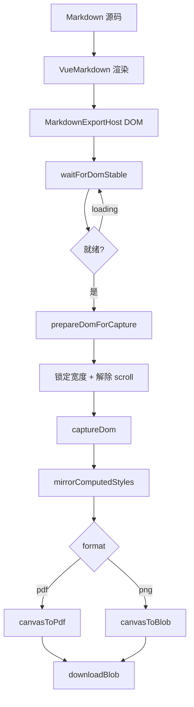
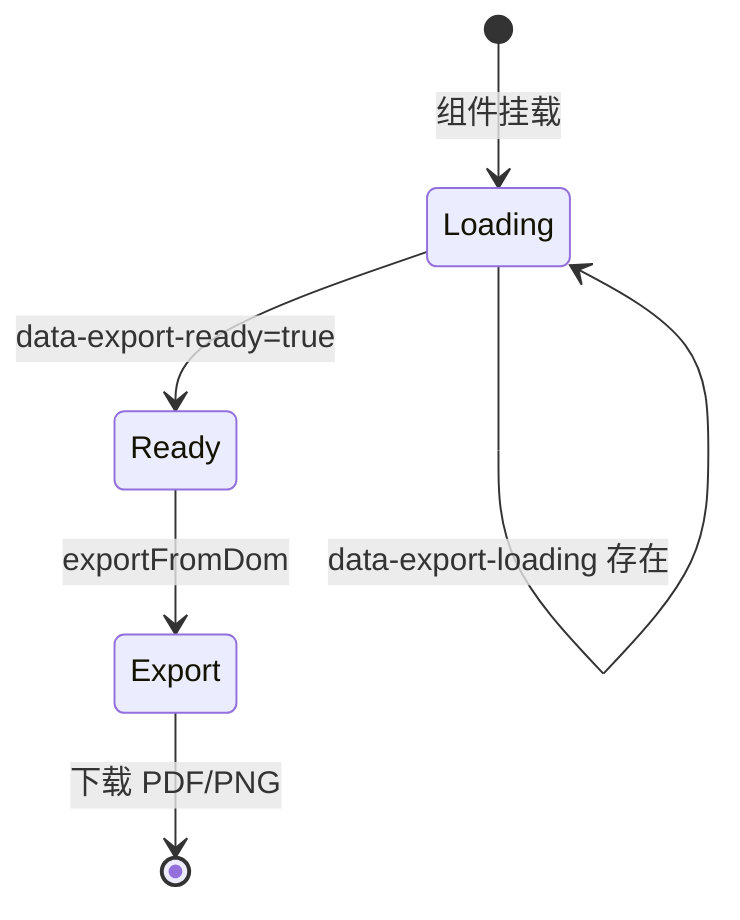

# markdown-export 技术路线图

> 基于 **DOM 截图** 的 Markdown 导出能力规划。主路径为「渲染即导出」，业务侧 Vue/React 自定义组件无需单独写导出适配。

## 一、总体目标

构建 **「预览即导出」** 能力：Markdown 渲染到真实 DOM 后，通过截图生成 PDF/PNG，与页面所见保持一致。

```
Markdown 源码
    ↓
VueMarkdown / ReactMarkdown（插件链 + 自定义组件）
    ↓
真实 DOM 渲染（MarkdownExportHost）
    ↓
waitForDomStable → prepareDomForCapture → captureDom → PDF / PNG
```

## 二、模块结构

```
markdown-export/
├── core/
│   ├── types.ts                 # DomExportOptions、CaptureOptions
│   ├── selectors.ts             # data-export-* 选择器常量
│   ├── cropCanvas.ts            # Canvas 裁剪
│   └── exportCaptureStyles.ts   # clone 文档修正 CSS
├── engine/
│   ├── waitForDomStable.ts      # 等待字体/图片/异步组件
│   ├── prepareDomForCapture.ts  # 锁定宽度、解除 scroll 约束
│   ├── inlineCloneStyles.ts     # 镜像计算样式到 clone
│   ├── injectExportStyles.ts    # 注入导出修正样式
│   ├── captureDom.ts            # html2canvas 截图
│   ├── canvasToPdf.ts           # 长图 → 多页 PDF
│   ├── downloadBlob.ts          # 下载 / 剪贴板
│   └── exportFromDom.ts         # 统一入口
├── ui/
│   ├── MarkdownExportHost.tsx   # 导出 DOM 宿主
│   └── ExportToolbar.tsx        # 导出按钮组
├── index.ts                     # 引擎导出入口
├── vue-ui.ts                    # Vue UI 导出入口
├── readme.md                    # 使用说明
└── ROADMAP.md                   # 技术路线图
```

### 与仓库其他模块的关系

| 模块 | 关系 |
|------|------|
| `markdown/` | 提供 VueMarkdown 渲染管线 |
| `remark-mermaid/` | MermaidBlock 内置 `data-export-ready` |
| `codeHighLight/` | 代码块样式由 DOM 截图自然保留 |
| `componentsUtils/` | 表格解析等工具，导出时无需额外适配 |

### 导入边界

| 入口 | 内容 |
|------|------|
| `@nnnb/markdown` | `exportFromDom`、`waitForDomStable`、`captureDom` |
| `@nnnb/markdown/vue-ui` | `MarkdownExportHost`、`ExportToolbar` |

## 三、阶段规划

### Phase 0 — 最小可用 ✅

**目标：** DOM 截图导出跑通，simple 演示可用。

| 交付物 | 状态 |
|--------|------|
| `exportFromDom` / `captureDom` / `canvasToPdf` | ✅ |
| `data-export-loading` / `data-export-ready` 协议 | ✅ |
| `MermaidBlock` export 属性对接 | ✅ |
| `MarkdownExportHost` / `ExportToolbar` | ✅ |
| simple `MarkdownEditor` 导出 PDF/PNG | ✅ |
| `html2canvas`、`jspdf` peerDep | ✅ |

---

### Phase 1 — 样式一致性与体验优化 🔄

**目标：** 导出结果与预览 **所见即所导**。

| 交付物 | 状态 |
|--------|------|
| 截图前锁定容器可视宽度 | ✅ |
| `mirrorComputedStyles` 镜像计算样式 | ✅ |
| 祖先 scroll/overflow 临时解除 | ✅ |
| clone 注入导出修正 CSS | ✅ |
| simple 引入 `markdown.module.scss` | ✅ |
| 代码块 `data-export-ignore` 隐藏工具栏 | ✅ |
| 超长文档分段截图（防内存溢出） | ⬜ |
| 导出进度 / 错误 UI 组件化 | ⬜ |
| KaTeX 公式字体专项规则 | ⬜ |
| Element Plus 表格样式专项规则 | ⬜ |
| 核心逻辑单元测试 | ⬜ |

**推荐调用方式：**

```ts
await exportFromDom({
  target,
  format: 'pdf',
  capture: {
    width: Math.ceil(target.getBoundingClientRect().width),
    syncStyles: true,
    pixelRatio: 2,
    fullPage: true
  }
});
```

---

### Phase 2 — 语法扩展与业务集成

**目标：** 丰富 Markdown 表达能力，完善业务接入。

| 交付物 | 优先级 |
|--------|--------|
| `remark-gfm`（表格、任务列表、删除线） | P0 |
| `rehype-slug` 标题锚点 | P0 |
| `rehype-toc` 目录侧栏 | P1 |
| `remark-admonition`（`:::tip` 提示块） | P1 |
| `ExportToolbar` 增强（剪贴板、配置面板） | P1 |
| 表格 CSV 导出（复用 `tableNodeParse`） | P2 |
| `ReactMarkdown` + `useMarkdownExport` | P2 |
| 业务 SDK：`createMarkdownExporter()` | P2 |

**自定义组件约定（零改造）：**

```vue
<div
  :data-export-loading="loading || undefined"
  :data-export-ready="!loading ? 'true' : 'false'"
>
  <MyBusinessComponent />
</div>
```

| 属性 | 含义 |
|------|------|
| `data-export-loading` | 存在则阻塞截图 |
| `data-export-ready="true"` | 显式标记就绪 |
| `data-export-ignore` | 截图时隐藏 |
| `data-export-expand` | 截图时强制展开 |

---

### Phase 3 — 高级能力与生产化

**目标：** 支撑 AI 对话导出、长文档、批量生产。

| 交付物 | 说明 |
|--------|------|
| 流式 Markdown 导出 | 等待 `[data-export-loading]` 消失后导出 |
| 超长文档 PDF 优化 | 分片截图 + 多页拼接 |
| 备选截图引擎 | `dom-to-image-more` fallback |
| 服务端 PDF | Puppeteer 适配器（可选） |
| HTML 快照导出 | 静态 HTML 归档（补充路径） |
| DOCX 导出 | HAST → docx（按需） |
| 插件懒加载 | mermaid / katex / export 按需加载 |
| 性能基准 | 大文档导出耗时、内存监控 |

## 四、核心流程

### 4.1 导出流水线



### 4.2 渲染就绪状态



## 五、技术选型

### 5.1 主路径：DOM 截图

| 方案 | 角色 |
|------|------|
| **html2canvas** | 默认截图引擎 |
| **jspdf** | Canvas → 多页 PDF |
| HAST 静态化 | 补充：HTML 归档、邮件正文 |
| Puppeteer | 可选：服务端高质量 PDF |

### 5.2 DOM 截图 vs HAST 静态化

| 对比项 | DOM 截图（主） | HAST → HTML（补充） |
|--------|----------------|---------------------|
| 自定义 Vue/React 组件 | 无需适配 | 需 `toExportHtml` |
| Element Plus / 图表库 | 天然支持 | 难还原 |
| 所见即所导 | 天然一致 | 需保证 materialize 一致 |
| PDF 文字可选 | 弱（图片型） | 较强 |
| 文件体积 | 偏大 | 较小 |

### 5.3 依赖策略

| 包 | 类型 | 用途 |
|----|------|------|
| `html2canvas` | peerDep | 截图 |
| `jspdf` | peerDep | PDF |
| `dom-to-image-more` | optional peerDep | 备选引擎 |
| `puppeteer-core` | optional peerDep | 服务端 PDF |

## 六、里程碑（建议）

```
Phase 0  DOM 截图 MVP              ✅ 完成
Phase 1  样式一致性优化             🔄 进行中（~60%）
Phase 2  语法扩展 + 业务集成        ⬜ 未开始
Phase 3  生产化 + 高级能力          ⬜ 未开始
```

| 阶段 | 建议工期 | 验收标准 |
|------|----------|----------|
| P1 收尾 | 2 周 | 导出与预览样式一致；无遮罩残留；长文档不崩溃 |
| P2 | 4 周 | GFM/TOC 可导出；React 可接入 |
| P3 | 4 周 | 流式导出稳定；5000+ 行可导出 |

## 七、风险与应对

| 风险 | 应对 |
|------|------|
| 跨域图片导致 Canvas 污染 | `useCORS: true` + 图片服务器 CORS |
| 超长文档内存溢出 | 分段截图（P1） |
| KaTeX 字体在 Canvas 丢失 | 字体 preload + 专项镜像规则（P1） |
| Element Plus 复杂 CSS 偏差 | 扩展 `mirrorComputedStyles` 属性（P1） |
| 图片型 PDF 不可搜索 | 提供 Print 入口作为补充 |
| 流式 MD 未写完就导出 | `data-export-loading` 阻塞 + UI 提示 |

## 八、进度总览

```
整体进度  ████████░░░░░░░░░░░░  ~40%

P0 导出 MVP     ████████████████████  100%
P1 样式一致     ████████████░░░░░░░░   60%
P2 语法/集成    ░░░░░░░░░░░░░░░░░░░░    0%
P3 生产化       ░░░░░░░░░░░░░░░░░░░░    0%
```

## 九、P1 下一步任务

1. KaTeX / Element Plus 专项样式镜像规则
2. 超长文档分段截图算法
3. `ExportToolbar` 导出进度与错误提示
4. `waitForDomStable`、`canvasToPdf` 单元测试

---

*最后更新：2025-05*
