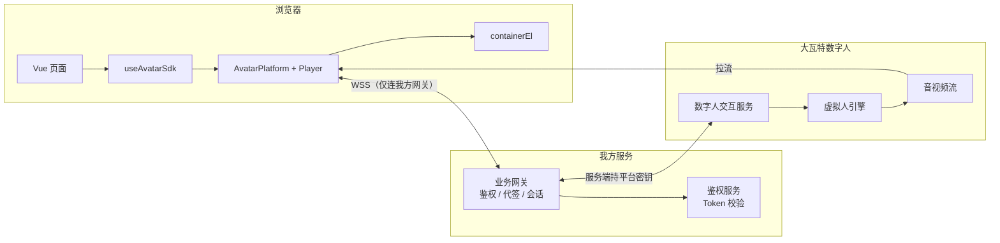
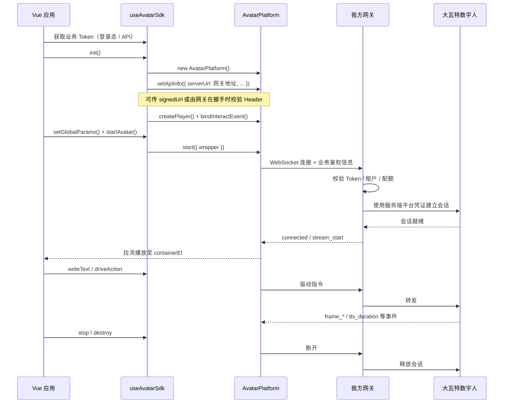
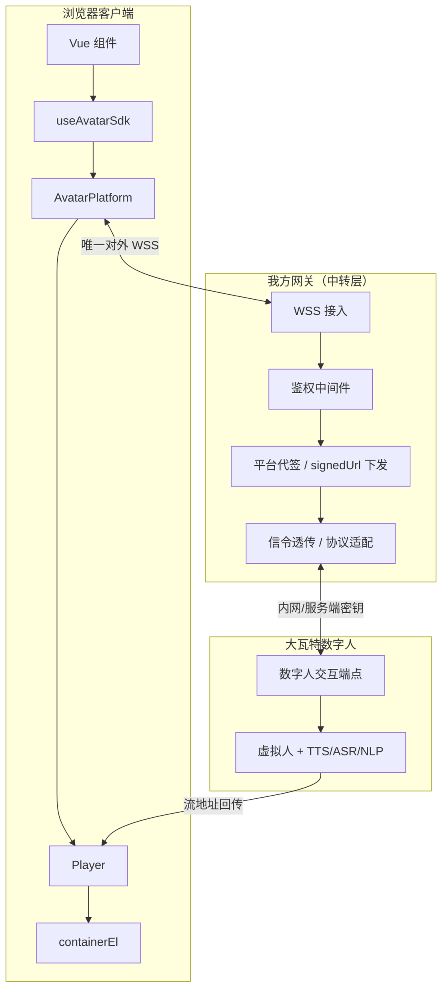
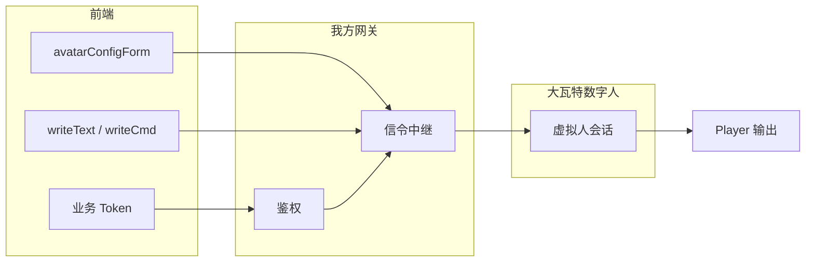
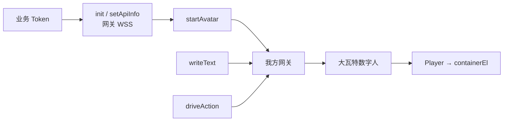

# 大瓦特数字人 SDK 说明文档

> 基于数字人 Web SDK 与 Vue 3 组合式封装 `useAvatarSdk`（`composables/useAvatar.ts`）整理。  
> **接入方式**：浏览器 → **业务网关鉴权** → 大瓦特数字人服务（非直连平台控制台密钥）。

---

## 1. 概述

大瓦特数字人 Web SDK 用于在浏览器中拉取虚拟人音视频流、进行 TTS 文本驱动、动作指令驱动，并支持 ASR/NLP 等交互事件回调。本项目通过 `**useAvatarSdk`\*\* 将 SDK 生命周期、配置表单与常用操作封装为 Vue Composition API。

**本方案采用网关中转**：前端只连接我方网关，由网关完成用户/租户鉴权、平台凭证签发或代签，再与大瓦特数字人服务建立会话。平台 `apiKey` / `apiSecret` **不下发到浏览器**。

| 项目         | 说明                                             |
| ------------ | ------------------------------------------------ |
| 封装入口     | `useAvatarSdk()`                                 |
| 前端连接地址 | 我方网关 WSS（见 `setApiInfo.serverUrl`）        |
| 鉴权主体     | 业务侧 Token / Session → 网关校验 → 大瓦特数字人 |

---

## 2. 技术路线

### 2.1 整体技术栈（网关中转）



### 2.2 集成分层路线

| 层级               | 技术选型                | 职责                                  |
| ------------------ | ----------------------- | ------------------------------------- |
| **应用层**         | Vue 3 + Composition API | 页面 UI、状态、生命周期               |
| **适配层**         | `useAvatarSdk`          | 初始化、事件绑定、参数下发            |
| **SDK 层**         | `AvatarPlatform`        | WebSocket 会话、文本/动作驱动         |
| **播放层**         | `IPlayer`               | 音视频流解码并渲染到 DOM              |
| **网关层（我方）** | WSS 网关 + 鉴权服务     | 校验业务 Token、代签/转发、审计与限流 |
| **能力层**         | 大瓦特数字人            | 形象渲染、TTS、ASR/NLP                |

### 2.3 推荐调用顺序（经网关）



## 3. 网关中转架构

### 3.1 逻辑架构



### 3.2 鉴权与职责划分

| 环节                        | 执行方                 | 说明                                             |
| --------------------------- | ---------------------- | ------------------------------------------------ |
| 用户登录 / 业务 Token       | 前端 + 业务后端        | 常规 JWT、Session 等，**不暴露平台密钥**         |
| Token 校验        | **我方网关**           | 未通过则拒绝 WSS，不触达大瓦特数字人             |
| 数字人资产形象和声音属性 | **我方网关（服务端）** | 鉴权是否存在资产数据和权限               |
| WebSocket 连接目标          | 前端 SDK               | `serverUrl` 指向**我方网关** |
| 拉流播放                    | 前端 Player            | 使用会话响应中的流信息，由 SDK 播放              |

### 3.3 数据流（驱动与配置）



### 3.4 前端 `setApiInfo` 对接网关（推荐）

网关鉴权通过后，前端仅需配置**我方地址**与**业务侧标识**；平台密钥由网关持有。

```ts
// 先请求我方 REST 换取 signedUrl，再写入 SDK
const { signedUrl } = await fetchSignedUrl(businessToken);
interativeRef.value.setApiInfo({
  serverUrl: 'wss://your-gateway.example.com/avatar/interact',
  // 其他参数
  ...option
});
```


### 3.5 生命周期与资源释放

| 阶段   | 行为                                           |
| ------ | ---------------------------------------------- |
| 登录   | 获取业务 Token                                 |
| 初始化 | `init` → 网关 `setApiInfo` → `createPlayer`    |
| 启动   | `setGlobalParams` → `startAvatar`              |
| 交互   | `writeText` / `driveAction` / `interrupt`      |
| 销毁   | `stop` + `destroy`（`onBeforeUnmount` 已处理） |

---

## 4. 常见问题

| 现象                     | 可能原因                    | 处理建议                              |
| ------------------------ | --------------------------- | ------------------------------------- |
| WSS 立即断开             | 业务 Token 无效或过期       | 检查网关鉴权日志，刷新 Token          |
| 401 / 网关自定义错误     | 未走网关、Header 缺失       | 确认 `serverUrl` 为我方地址及握手参数 |
| 连接成功无画面           | 大瓦特侧 scene/形象配置错误 | 查网关转发日志与平台返回              |
| 直连平台成功、走网关失败 | 网关未代签或协议未透传      | 对照网关与 SDK 握手字段               |
| 自动播放无声             | 浏览器策略                  | `playNotAllowed` 后 `player.resume()` |
| `writeText` 失败         | 会话未 `start` 或 vcn 无效  | 先 `startAvatar`，检查 TTS 配置       |

## 附录：Composable 调用链



